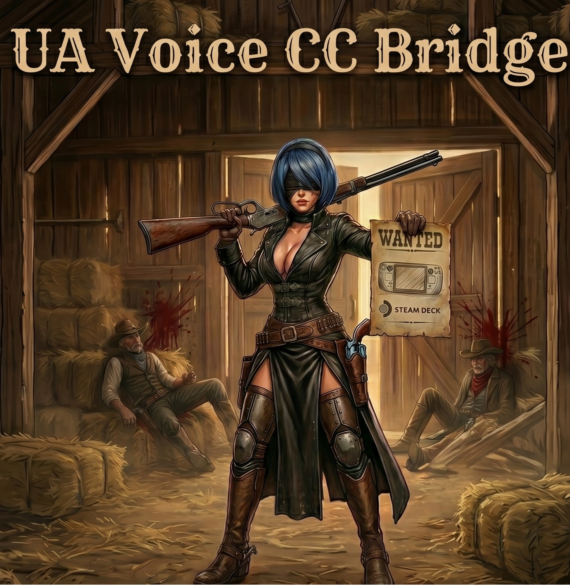

<div align="center">



# UA Voice CC Bridge

**Плагін для Steam Deck який озвучує субтитри українською мовою**

[](https://github.com/Fok86/UA_VoiceCCBridge/releases/latest)
[](https://store.steampowered.com/steamdeck)
[](LICENSE)
[](https://github.com/SteamDeckHomebrew/decky-loader)

</div>

---

> ⚠️ **Важливо:** Плагін **не робить переклад**! Він лише зчитує та озвучує субтитри які вже є в грі. Гра повинна мати вбудовані українські субтитри.

## ⚡ Як це працює

```
Знімок екрану → OCR (Tesseract) → Синтез мови (Piper / RHVoice) → Звук
    ~200мс           ~100мс                  ~160мс
```
> Загальна затримка від появи субтитрів до озвучення: **~300мс**

---

## ✨ Можливості

| | |
|---|---|
| 🎯 | Розпізнавання субтитрів в будь-якій грі |
| 🔊 | **8 голосів** українською (Piper + RHVoice) |
| 🎮 | Профілі налаштувань для кожної гри окремо |
| ⌨️ | Режим "Друкарська машинка" |
| 🎛️ | Повне налаштування зони, фільтрів, OCR і TTS |
| 👁️ | Превью в реальному часі |

---

## 🔊 Голоси

<table>
<tr>
<td width="50%">

### 🧠 Piper (нейронний синтез)
| Голос | Тип |
|-------|-----|
| 👨 Микита | чоловічий |
| 👩 Лада | жіночий |
| 👩 Тетяна | жіночий |
| 🧒 Даринка | дитячий |

</td>
<td width="50%">

### ⚡ RHVoice (легкий синтез)
| Голос | Тип |
|-------|-----|
| 👨 Anatol | чоловічий |
| 👨 Volodymyr | чоловічий |
| 👩 Natalia | жіночий |
| 👩 Marianna | жіночий |

</td>
</tr>
</table>

> 💡 **RHVoice** споживає значно менше ресурсів CPU — **не краде FPS у важких іграх!**

---

## 📦 Встановлення

**1.** Завантаж zip з **[Releases](https://github.com/Fok86/UA_VoiceCCBridge/releases/latest)**

**2.** Розпакуй в `/home/deck/homebrew/plugins/`

**3.** Перезапусти Decky:
```bash
sudo systemctl restart plugin_loader
```

---

## 🚀 Перший запуск

```
1. Запусти гру з українськими субтитрами
2. Плагін → "Зона субтитрів" → Зробити знімок → Зберегти
3. "Фільтри зображення" → Вибери колір субтитрів → Зберегти  
4. "OCR" → Тест OCR → перевір розпізнавання
5. "Синтез мови" → Вибери голос → Тест → Зберегти
✅ Готово!
```

---

## 🛠️ Технічні деталі

| Компонент | Технологія |
|-----------|-----------|
| OCR | [Tesseract 5](https://github.com/tesseract-ocr/tesseract) + [tesserocr](https://github.com/sirfz/tesserocr) |
| TTS (Piper) | [Piper](https://github.com/rhasspy/piper) + [ukrainian-tts](https://github.com/robinhad/ukrainian-tts) |
| TTS (RHVoice) | [RHVoice](https://github.com/RHVoice/RHVoice) |
| EQ | SoX — Sound eXchange |
| Знімок | GStreamer + PipeWire |
| UI | React + Decky Loader SDK |

---

## 💙 Підтримати проєкт

<div align="center">

**Якщо плагін корисний — підтримай розробку!**

🏦 **Monobank:** [send.monobank.ua/jar/7oNtZZsgCb](https://send.monobank.ua/jar/7oNtZZsgCb)

💳 **Картка:** `4874 1000 2613 9066`


</div>

---

<div align="center">

MIT License • Зроблено з ❤️ для українських гравців

</div>
